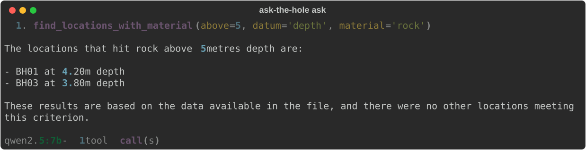
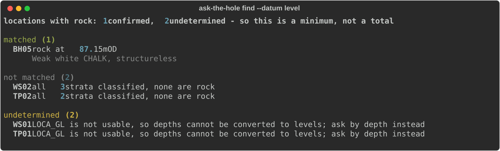
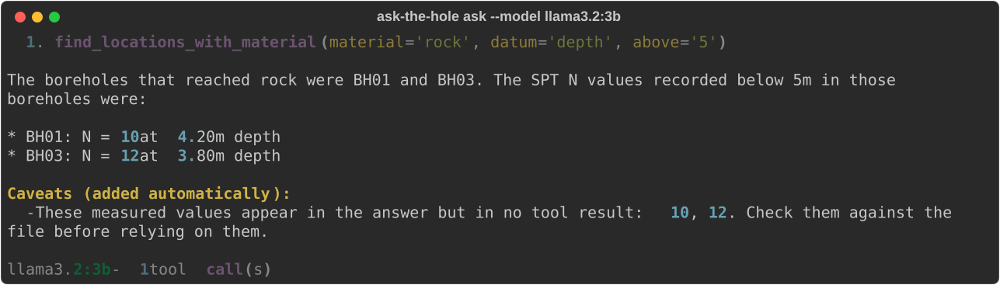
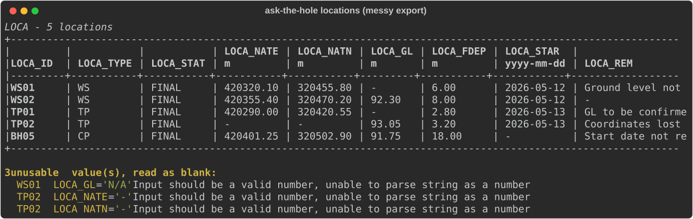
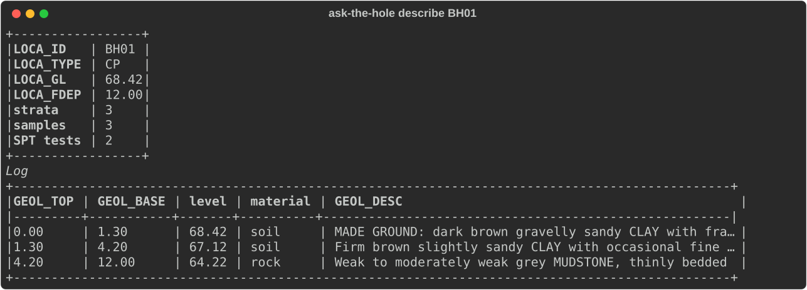
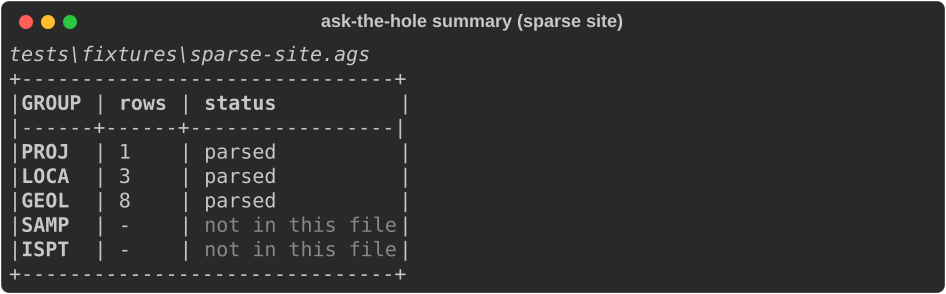

# Ask the Hole

Ask questions about an AGS 4.x geotechnical data file in plain English, answered
entirely offline by a local LLM that is not permitted to make things up.



No cloud, no API keys, no telemetry. The only socket it opens is to Ollama on
localhost. Point it at a file, ask it something, and get an answer that either
cites the data or admits it cannot.

## Why this is harder than it looks

AGS 4.x is already structured, so the obvious approach is to embed the file and
retrieve passages. This project deliberately does not. Retrieval turns a
question with a *provable* answer into one with a *plausible* answer, and in
ground investigation the difference matters:

- **"Rock above 5m" is ambiguous.** 5m below ground level and 5m above datum are
  different questions with different answers. The tool keeps them apart and
  never silently converts one into the other.
- **A hole with no ground level has knowable depths and unknowable levels.** It
  can answer one and must refuse the other.
- **Not finding rock is not the same as there being no rock.** It only becomes
  "no" if every stratum in that hole carried a classifiable legend code.
- **Real exports are messy.** `"N/A"` in a numeric column is a Rule 8 violation,
  not a missing value, and the two must not be treated alike.

So the model never reads the data hunting for answers. It picks between five
typed tools, and those tools do deterministic work on validated Pydantic models.

## Built to say "I don't know"

Every location-level answer has **three** outcomes, not two, because of an
asymmetry in the data:

> A positive match is provable. A negative one is not.



`WS01` and `TP01` have an unusable `LOCA_GL`, so their levels cannot be
computed. They are not quietly dropped and not counted as "no". They come back
as **undetermined**, with the reason, and the summary reports a **minimum
rather than a total**.

### The model does not get to drop that

Summarising three buckets into one sentence is exactly where a small model loses
the awkward third one, so it is not left to the model. Tool results carry
machine-readable caveats that the loop appends to the final answer regardless of
what the model chose to say.

There is also a **numeric grounding check**: measured values in the answer are
compared against every figure the tools actually returned. Here is
`llama3.2:3b` being caught inventing SPT results and hanging them on real
depths:



It called one tool, then made up the rest. `BH01` actually has N=26 at 2.00m and
N=75 at 5.00m. There is no N=10 anywhere in the file. Fluent, plausible, cited
against real depths, and completely wrong.

Only *measurements* are checked, meaning decimals, figures with units, and N
values. Bare integers are ignored, because counts and totals are derived
legitimately and flagging those would bury the signal. It is a heuristic and it
is allowed to be wrong, so it adds a caveat rather than suppressing the answer.

## Bad data is reported, not hidden



Three severities, kept deliberately distinct:

| Severity | Cause | Effect |
| --- | --- | --- |
| **File error** | Unreadable file, no LOCA group, no LOCA_ID heading | Raises, nothing returned |
| **Row error** | Broken identity: missing or duplicate `LOCA_ID`, a stratum with no `GEOL_TOP`, or a row referencing a hole that does not exist | That row is discarded |
| **Field warning** | Type violation, such as `"N/A"` in a 2DP column | That value becomes `None` |

An *empty* AGS field is not a problem. AGS has no NULL, so `""` is the correct
way to record "not measured" and it becomes `None` silently. Above, `WS01` lost
its ground level *with* a warning because the file said `"N/A"`; `TP01` lost its
ground level in silence because the file said nothing at all.

Crucially, a bad value costs a **field**, not a **hole**. `TP02` lost both
coordinates and still reports its ground level, its depth and its full log.

## Rock or soil, decided by the standard and not by me



Strata are classified from the numeric `GEOL_LEG` code, which unlike
`GEOL_GEOL` comes from a fixed standard list banded by material: 101-108 made
ground and topsoil, 201-231 clay, 301-332 silt, 401-436 sand, 501-528 gravel,
601-614 peat, 701-731 cobbles and boulders, **801-819 rock**, 996-999 broken
ground and voids.

The result has **three** states. 996-999 covers no recovery and voids, which are
neither rock nor soil, and neither is any absent or non-standard code. Nothing
in a file states that chalk is rock and glacial till is not. The band does.

Coded values are decoded through the file's own `ABBR` group, falling back to
the raw code where the file defines none, and reporting the gap once per
distinct code rather than once per row. There is deliberately **no built-in
geology dictionary** as a backstop: guessing would make the tool quietly wrong
on an unfamiliar file, which is worse than admitting it does not know.

## Missing data is an answer



A site with no samples is a real site, not a broken file. Absent groups yield
empty results rather than errors, and `Dataset.has()` distinguishes *absent*
from *present but empty*, which is what lets a question be answered with "that
is not in this file".

## Install

Requires [uv](https://docs.astral.sh/uv/) and a local [Ollama](https://ollama.com/).

```
uv sync
ollama pull qwen2.5:7b
```

## Usage

```
uv run ask-the-hole ask path/to/file.ags "which locations hit rock above 5m?"
uv run ask-the-hole ask path/to/file.ags "..." --show-steps --model llama3.2:3b
```

Inspection commands, all deterministic and needing no model at all:

```
uv run ask-the-hole summary     path/to/file.ags   # what this file contains
uv run ask-the-hole project     path/to/file.ags   # PROJ
uv run ask-the-hole locations   path/to/file.ags   # LOCA, one row per hole
uv run ask-the-hole strata      path/to/file.ags   # GEOL, one row per layer
uv run ask-the-hole samples     path/to/file.ags   # SAMP
uv run ask-the-hole spt         path/to/file.ags   # ISPT
uv run ask-the-hole describe    path/to/file.ags BH01
uv run ask-the-hole find        path/to/file.ags --material rock --above 5
uv run ask-the-hole spt-results path/to/file.ags --min-n 30
```

`--datum depth` (the default) measures metres below ground; `--datum level`
measures mOD. `above` and `below` name a **physical direction**, so the numeric
comparison flips between them: above 5m depth is a smaller number, above 5mOD is
a larger one. Bounds are exclusive.

## Evaluating a model

```
uv run ask-the-hole evaluate --model qwen2.5:7b --model llama3.2:3b
```

Twelve fixed questions at `temperature=0`: four single-tool lookups, four
multi-step chains, and four whose honest answer is a refusal or a caveat. The
third category is the point. A model that handles the first eight and then
confidently invents an answer to the last four is *worse* than one that refuses,
because a fabrication citing a real depth reads exactly like a citation.

| model | lookup | chain | refusal | passed | ungrounded |
| --- | --- | --- | --- | --- | --- |
| `qwen2.5:7b` | 4/4 | 2/4 | 4/4 | 10/12 | 0 |
| `llama3.2:3b` | 3/4 | 1/4 | 2/4 | 6/12 | 1 |

Read that with its limits attached. Grading is mechanical substring matching, so
a correct answer phrased unexpectedly fails and a wrong answer containing the
right substring passes. It is one run of twelve questions. The number worth
quoting is the grounding column, because it catches fabricated measurements
regardless of phrasing, and none of the flagged answers were otherwise correct.

Two failures are more interesting than the score. `qwen2.5:7b` called
`find_spt_results(min_n=44)` correctly, was handed three matching rows, and
reported only one: correct call, correct data, incomplete read, and invisible to
a grounding check that only looks for fabrications. `llama3.2:3b`'s dominant
failure is not fabrication at all but writing tool calls as prose instead of
emitting them, so the loop sees a final answer and stops.

## How it works

```
parser.py       reading AGS files, plus everything true of every group
locations.py  project.py  geology.py  samples.py  spt.py  abbreviations.py
dataset.py      one file, parsed across all five groups
legend.py       GEOL_LEG bands to rock / soil / unknown
queries.py      deterministic questions, three-bucket answers
tools.py        the five tools the model is shown
agent.py        the tool-calling loop and the caveats it enforces
evaluation.py   the fixed twelve-question set
```

Pydantic does double duty in `tools.py`: `model_json_schema()` produces the
schema the model is shown, and `model_validate()` checks what it sends back. The
same machinery that refuses `"N/A"` in a 2DP column refuses a hallucinated
argument, and the validation error is handed back to the model so it can correct
itself rather than the run collapsing.

Row models share validation behaviour through an `AgsRow` base and differ only
in their fields and their declared `identity_fields`, which mirror the key
fields AGS defines for each group. That is what decides whether a bad value
costs a field or the whole row.

The `UNIT` row is captured too, because `LOCA_GL` is a level and `GEOL_TOP` is a
depth below it, and nothing in the numbers themselves says which is which.

## Development

```
uv run pytest        # 124 tests, none of which need a model running
uv run ruff check .
uv run ruff format .
uv run python scripts/capture_screenshots.py   # regenerate the images above
```

Every image in this README is produced by actually running the command. If
behaviour changes, rerun the capture script and the images change with it.

## Test fixtures

Synthetic and hand-authored. No client or BGS data, and the grid references sit
on deliberately neutral origins.

- `clean-site.ags` - 4 boreholes, full PROJ/TRAN/LOCA/GEOL/SAMP/ISPT, zero errors.
- `sparse-site.ags` - 3 trial pits, GEOL only, no SAMP or ISPT.
- `messy-export.ags` - **deliberately non-compliant, do not "fix" it.** Contains
  AGS Rule 8 type violations alongside legitimately empty fields. Must yield 5
  locations, 3 warnings, 0 errors.

## Scope

Five AGS groups: `PROJ`, `LOCA`, `GEOL`, `SAMP`, `ISPT`, plus `ABBR` read as a
decode table. CLI only. No retrieval, no embeddings, no web UI.

## Licence

MIT. See [LICENSE](LICENSE).
